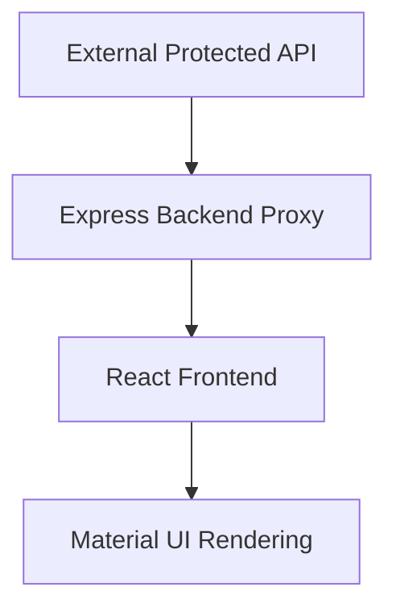

# AffordMed Campus Notifications

An evaluation-ready campus notification system for the AffordMed assessment. The application uses a React + Vite frontend, an Express backend proxy, and the protected AffordMed notification API to deliver a normalized, responsive, and accessible notification experience.

## Features

- All Notifications page for browsing the full notification feed.
- Priority Inbox page for ranked, high-priority notifications.
- Filter by notification type: Placement, Result, and Event.
- Pagination for large notification sets.
- Viewed and unread tracking persisted in `localStorage`.
- Responsive Material UI interface for desktop and mobile layouts.
- Keyboard-accessible notification cards.
- Backend proxy for protected API access.
- AffordMed logging middleware integration on the backend.
- Loading and error states for API reliability.
- Notification normalization to a stable frontend shape.
- Priority ranking algorithm based on notification type and recency.

## Screenshots

Add these screenshots before submission:

- [All Notifications page](screenshots/all-notifications.png)
- [Priority Inbox page](screenshots/priority-inbox.png)


## Tech Stack

### Frontend

- React 19
- Vite
- Material UI
- Axios

### Backend

- Node.js
- Express
- dotenv

### Supporting Tools

- localStorage for viewed state persistence
- AffordMed logging middleware
- Protected external API proxying through Express

## Architecture Overview



The backend receives requests from the frontend, attaches protected credentials from environment variables, forwards the request to the external API, and returns a normalized response. The frontend consumes only the backend API, applies filtering and priority sorting locally, and renders the results with Material UI components.

## Folder Structure

```text
.
├── backend/ (symlink to notification_app_be/)
│   ├── server.js
│   ├── controllers/
│   ├── routes/
│   ├── services/
│   └── logging_middleware/
├── frontend/ (symlink to notification_app_fe/)
│   ├── index.html
│   ├── vite.config.js
│   └── src/
│       ├── api/
│       ├── components/
│       ├── pages/
│       ├── utils/
│       ├── App.jsx
│       └── main.jsx
├── logging_middleware/
├── notification_system_design.md
└── README.md
```

## Installation

### Backend

```bash
cd notification_app_be
npm install
npm start
```

Backend URL:

```text
http://localhost:5000
```

### Frontend

```bash
cd notification_app_fe
npm install
npm run dev
```

Frontend URL:

```text
http://localhost:3000
```

## Environment Variables

### Backend

Create `notification_app_be/.env`:

```env
PORT=5000
TOKEN=your_protected_api_token
```

### Frontend

Create `notification_app_fe/.env`:

```env
PORT=3000
TOKEN=your_optional_logging_token
```

Notes:

- The frontend is configured to run only on `localhost:3000`.
- The backend acts as the proxy to the protected API.
- No notification data is hardcoded in the UI.

## API Endpoints

### GET /notifications

Returns the full notification feed through the backend proxy.

Response shape from the protected API:

```json
{
	"notifications": [
		{
			"ID": "",
			"Type": "",
			"Message": "",
			"Timestamp": ""
		}
	]
}
```

### GET /priority

Returns notifications ranked by the priority algorithm.

## Notification Normalization

The protected API returns uppercase keys, while the frontend expects a consistent internal shape. The backend/frontend data layer normalizes each record into:

```json
{
	"id": "",
	"type": "",
	"message": "",
	"timestamp": ""
}
```

This keeps UI components simple and avoids scattered response-shape checks across pages.

## Priority Algorithm

Priority ranking uses notification type and timestamp recency.

Weights:

- Placement = 3
- Result = 2
- Event = 1

Scoring formula:

```text
priorityScore = (weight × 1000000) + timestamp_recency
```

Higher scores rank first. This ensures Placement notifications appear ahead of Result notifications, which appear ahead of Event notifications, while still preserving recency inside each category.

## Viewed / Unread Tracking

Viewed notifications are persisted in `localStorage` under the key `notification_viewed_ids`.

Behavior:

- When a card is opened, its identifier is added to the viewed set.
- Viewed state survives page refreshes.
- Unread items are derived by checking whether the ID exists in the stored list.

## Logging Middleware

The backend integrates AffordMed logging middleware for structured request and service logging.

Key points:

- Logging requests are centralized in the backend.
- The logging middleware is token-aware and reads credentials from environment variables.
- Logging failures do not break the notification flow.
- The frontend uses safe client-side logging helpers where needed, without importing server-only code.

## Error Handling

The application includes defensive handling for common runtime failures:

- Loading states while data is fetched.
- Graceful error messages when the API request fails.
- Validation of response shape before rendering.
- Safe fallback behavior when logging fails.
- Route-level protection through the backend proxy.

## Responsive Design

The UI is designed to work across desktop and mobile viewports.

- Material UI layout primitives handle responsive spacing and grid behavior.
- Notification cards adapt to available width.
- Pagination and filter controls remain usable on smaller screens.
- The interface maintains readable typography and touch-friendly interaction targets.

## Assumptions

- The protected API is accessible only through the backend proxy.
- The frontend runs only on `http://localhost:3000` during evaluation.
- The backend runs on `http://localhost:5000`.
- The provided token is valid for the protected notification API.
- Notification records always include `ID`, `Type`, `Message`, and `Timestamp` fields.

## Future Improvements

- Add code-splitting for larger frontend bundles.
- Add search across notification content.
- Add route-level caching for repeated API requests.
- Expand analytics around unread counts and user engagement.
- Add automated tests for normalization and priority ranking.

## Notes for Evaluators

- The frontend is intentionally configured for `localhost:3000` only.
- The backend is the sole proxy to the protected external API.
- No hardcoded notifications are used in the UI.
- All displayed notifications are fetched from the provided API and normalized before rendering.
- The implementation follows the assessment constraints and preserves a clean separation between proxy, normalization, ranking, and UI rendering.